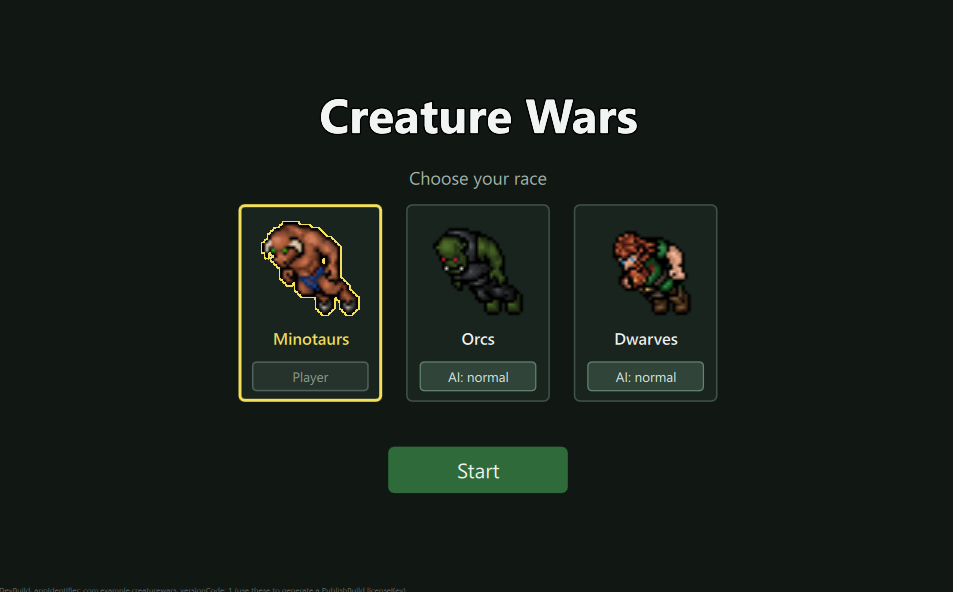
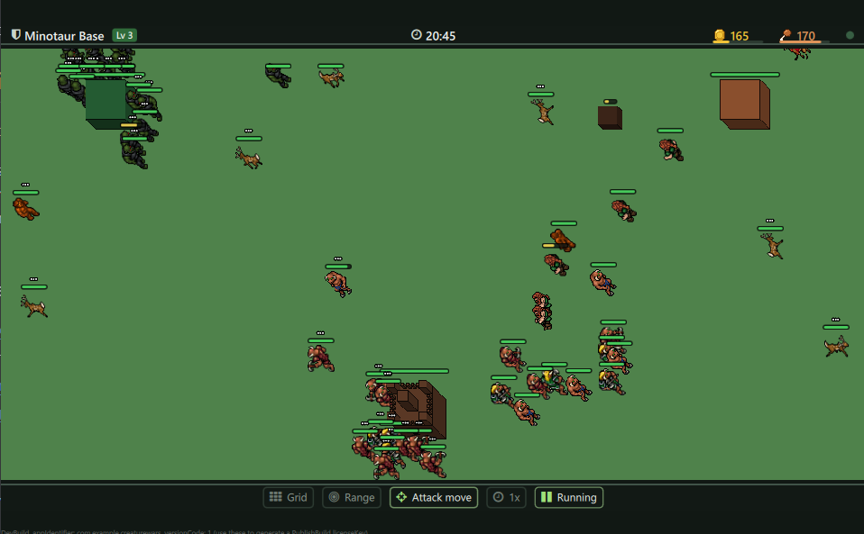
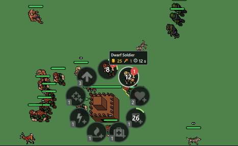
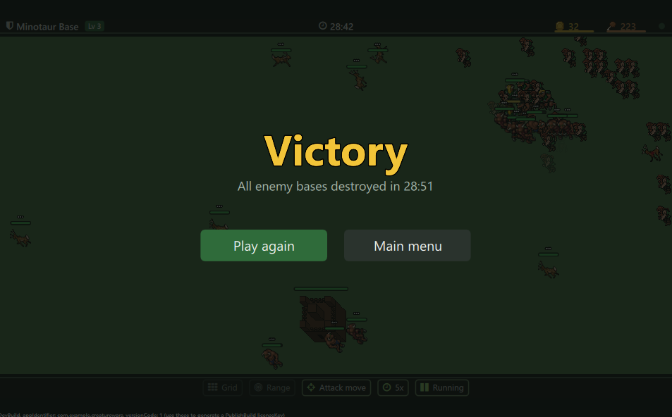

# Creature Wars

Creature Wars is a small real time strategy game for desktop and mobile, made with Felgo 4
and Qt 6. For now there are three races to choose from (Minotaurs, Orcs and Dwarves), and
many more are planned. You build up your base, train an army and try to destroy every
enemy base before they get to yours.

The game is mostly about decisions. Every moment you have to choose between attacking,
building up your base or gathering resources. Attack too early and your army breaks on the
enemy walls. Wait too long and the enemy outgrows you. Chasing rewards from wild creatures
can pay off, but it also leaves your base open.

I made it for the Felgo developer challenge: one week to build a complete game with Felgo
and write a tutorial about it. The tutorial is written in QDoc and you can find it in the
[docs](docs/) folder.

## What is in the game

- Three races for now, each with its own base stats and four unit tiers
- Bases with four levels, research upgrades and a radial action menu
- Gold and food income that grows with your base level
- Unit selection, move and attack orders, attack move and target highlighting
- Mages that deal area damage
- Bases that heal nearby units with a healing aura and can fire several shots per turn
- Computer controlled opponents and wild creatures that drop rewards
- Win and lose conditions with a game over screen
- Graphics in the oblique projection with assets for several screen densities
  (temporary sprites for now, see Assets below)

## How to play

1. Choose your race on the start screen and press Start.
2. Hover your base (or select it) to open the action menu. From there you can spawn units,
   research upgrades and upgrade the base. Every action costs gold and food and takes some time.
3. Decide how to spend them. More units let you attack sooner, research and base upgrades
   make you stronger later, and wild creatures give extra resources if you can spare the army.
4. Click or drag with the left mouse button to select your units. Right click the ground to
   move them and right click an enemy to attack it. Turn on Attack move if your units should
   fight everything they meet on the way.
5. You win when all enemy bases are destroyed. You lose when your own base falls.

## Architecture

The game is built like an MMORPG server monolith, following servers such as
[The Forgotten Server](https://github.com/otland/forgottenserver). One core owns the whole
game state and runs in its own thread. The client only draws what the core reports and sends
player commands back. Right now the game runs offline, with the core and the client in one
process.

At the heart of the core there is a dispatcher and a scheduler. The dispatcher runs tasks one
by one in the order they arrive. The scheduler holds everything that has to happen at a given
time (income, unit production, research, attacks) and hands it to the dispatcher when the
time comes. Player commands, AI decisions and timed events all go through the same queue, so
nobody gets to act out of turn. That keeps the real time strategy fair: the player and the
computer opponents play by exactly the same rules and timing.

    C++20 core (no Qt)
        game_t with one game thread
        dispatcher for queued tasks and a scheduler for timed events, both in the TFS style
        creatures, bases, map, pathfinding, visibility, economy, research
        game rules loaded from data/*.json
            |  events through igame_observer_t            ^  commands (request_* calls)
            v                                             |
    Qt bridge
        GameObserver moves events to the UI thread, GameBackend and list models expose them to QML
            |
            v
    Felgo and QML client
        GameWindow, scenes, TexturePacker sprites, EntityManager, HUD

Since the core does not use Qt at all and only talks to the client through commands and
events, it can be moved into a separate server later without rewriting the game logic.

### Felgo features used

- GameWindow and Scene with letterbox scaling and gameWindowAnchorItem
- Switching between scenes with states and transitions
- TexturePackerSpriteSequence and TexturePackerAnimatedSprite for sprite sheets
- MultiResolutionImage with +hd and +hd2 assets
- EntityManager and EntityBase for short lived effects
- AppButton, AppText and AppIcon with IconType
- FelgoApplication

## Building

You need the Felgo 4 SDK (Qt 6.8.3), CMake 3.16 or newer and a C++20 compiler
(MinGW 13 on Windows).

1. Open CMakeLists.txt in the Qt Creator that comes with Felgo.
2. Pick the Felgo desktop kit or an Android kit and build appCreatureWars.

To build only the core and run the unit tests:

    cmake -S . -B build/core -DCREATURE_WARS_BUILD_APP=OFF -DBUILD_TESTING=ON
    cmake --build build/core
    ctest --test-dir build/core --output-on-failure

The documentation is built with the docs target (qdoc has to be in your PATH).
The HTML ends up in docs/html.

## Project structure

| Folder | What you find there |
|---|---|
| backend | Game core in C++ (types ending with _t, no Qt) and the Qt bridge |
| qml | Felgo and QML client, scenes and components |
| data | Game rules for creatures, bases, the tech tree and the economy |
| assets | Sprites and UI icons, with +hd and +hd2 variants |
| shaders | Outline and tint shaders |
| scripts | Placeholder art generator and CI helpers |
| tests | GoogleTest unit tests for the core |
| docs | QDoc tutorial |

## Plans

- Original pixel art for every creature, building and UI element, so the whole game has one
  consistent pixel art style
- Many more races, each with its own units, strengths and play style
- Online mode with a standalone server (a few instances on a VPS) and thin clients that
  reuse the command and event protocol of the core
- Mobile release for Android and iOS with controls designed for touch
- Cross platform development stays the base for every new feature
- Dragon Lair, a strong neutral creature: will you fight the dragon for resources or go after your opponent?
- Music and sound effects
- More balancing of races, units and the economy
- Translations

## Development notes

- The C++ backend uses snake_case, types end with _t and function parameters with _p.
- QML and the C++ API exposed to QML use the usual Qt camelCase.
- I used AI coding assistants (OpenAI Codex and Anthropic Claude) to speed up development.

## Copyright and license

Copyright (c) 2026 PioD. All rights reserved.

This repository is public so it can be reviewed as part of the Felgo developer challenge.
The source code, game design and documentation belong to the author. You may view and
build the code to evaluate it. Copying, modifying, distributing or publishing the software,
fully or in part, requires written permission from the author. The temporary creature
sprites are not covered by this, see Assets below.

### Third party software

- [Felgo](https://felgo.com), used under the Felgo license terms
- [Qt](https://www.qt.io), shipped with the Felgo SDK under its own license
- [nlohmann/json](https://github.com/nlohmann/json), MIT License
- [GoogleTest](https://github.com/google/googletest), BSD 3-Clause License

### Assets

All assets will be completely replaced in the future with original ones, either generated with AI or drawn by hand.
